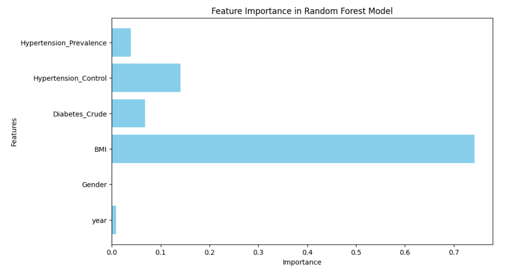
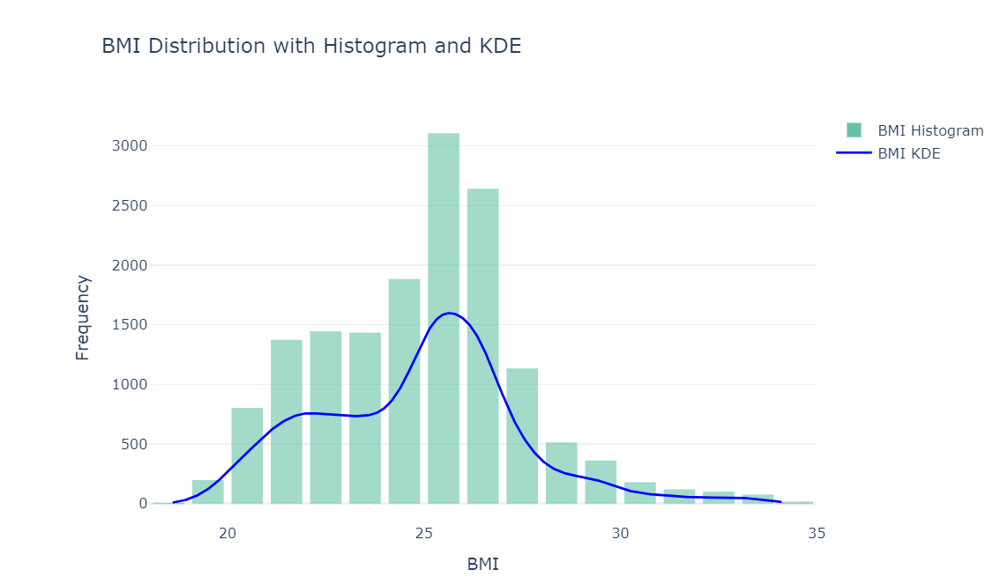
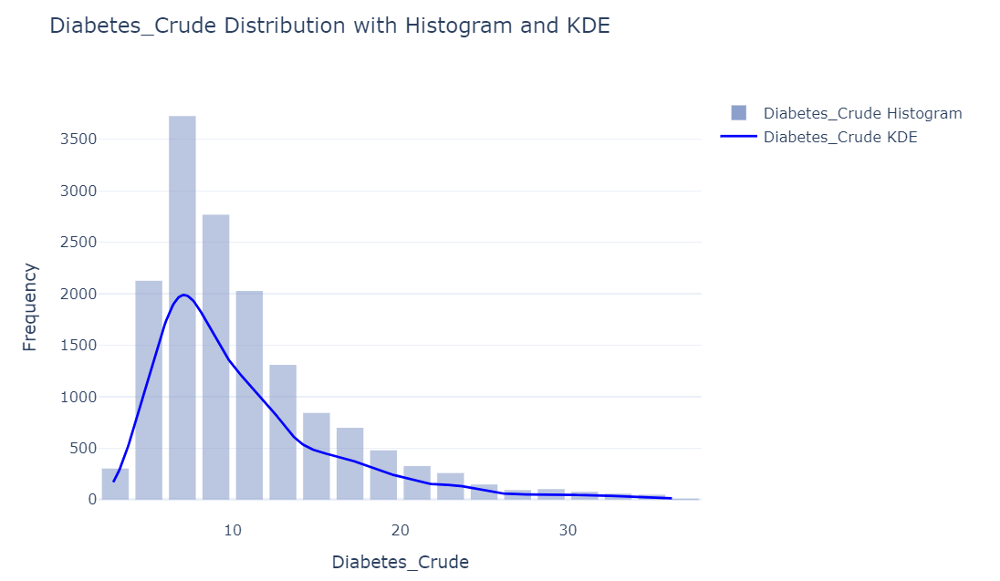
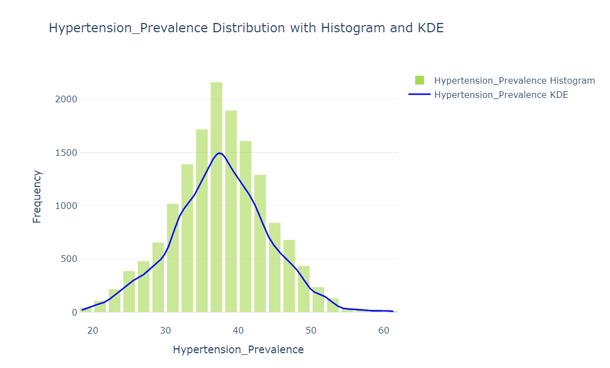
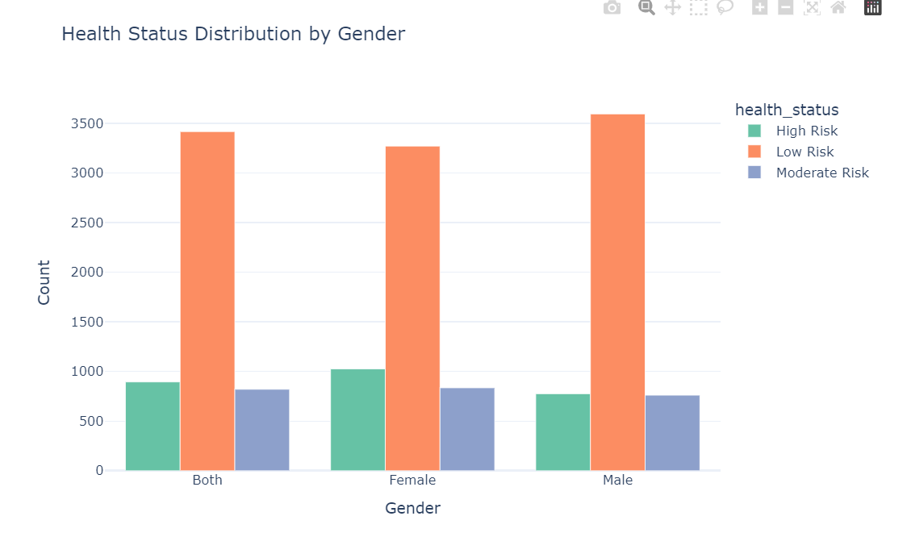
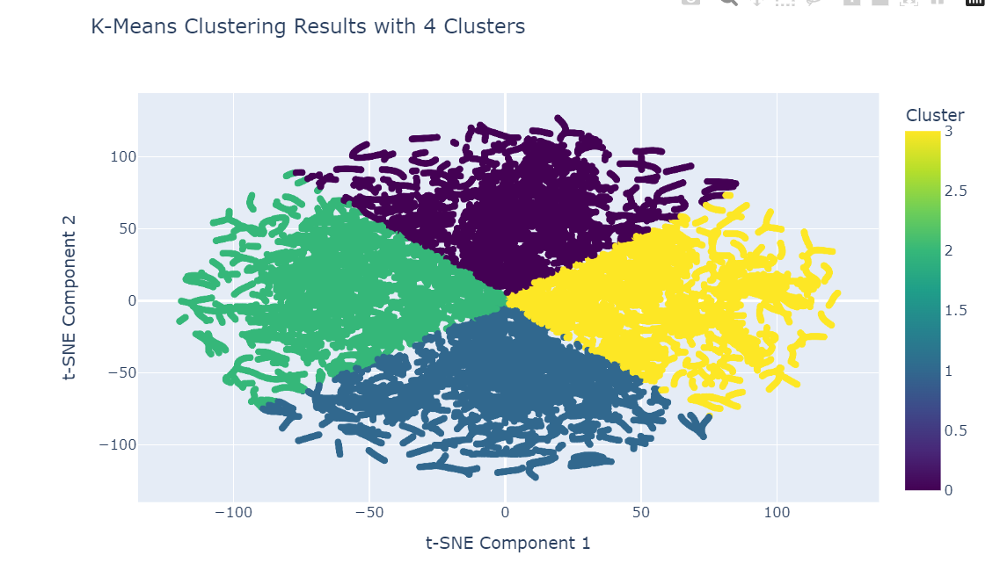

### **Introduction**

Chronic diseases pose some of the greatest challenges to global health[@clark2003management]. Unlike acute conditions, they develop gradually and persist for extended periods, often leading to serious complications, reduced quality of life, and increased mortality[@bengmark2004acute]. Their widespread impact extends beyond individuals, burdening healthcare systems and exacerbating global health inequities[@mcphail2016multimorbidity]. Conditions such as diabetes, heart disease, and hypertension are particularly concerning due to their rising prevalence and profound social and economic consequences.

Despite the vast amounts of health data collected by organizations like the World Health Organization (WHO), much of this data remains fragmented and underutilized[@de1996anthropometric]. Essential health indicators are often scattered across various sources, making it difficult to form a complete picture of the global burden of chronic diseases. This project was motivated by the need to bridge that gap by creating a unified dataset that integrates key chronic disease indicators.  

Health data tells compelling stories. For example, a rising average BMI in a country could signal the onset of a diabetes epidemic[@bmi_diabetes_nih]. An increase in hypertension prevalence might foreshadow a surge in heart attacks or strokes[@fuchs2019hypertension]. These indicators act like warning signals, flashing on a control panel—if monitored and interpreted correctly, they can guide timely public health interventions, inform resource allocation, and shape life-saving policies.  

However, effective health policies require more than isolated statistics. They demand a comprehensive, data-driven understanding of how chronic diseases interact with demographic factors, geographic locations, and time trends. This project is driven by the belief that integrated data leads to deeper health insights. By building a unified dataset from WHO's publicly available statistics, we aim to explore the following questions:

- How accurately can chronic disease risks be predicted based on health indicators such as BMI, diabetes prevalence, and hypertension control?
- Which features contribute most to predicting chronic disease outcomes, and how do their impacts differ across models?
- Can binary classification models effectively distinguish between low-risk and high-risk individuals?
- How well can multiclass classification models categorize individuals into specific health risk levels based on integrated health data?
- Can clustering methods uncover hidden patterns in chronic disease data, such as emerging risk groups not defined by existing health indicators?

By transforming global health data into actionable insights, this project aims to bridge the gap between data analysis and meaningful health solutions. We leverage machine learning models to predict chronic disease risks, evaluate the impact of critical features, and explore underlying patterns using BMI, diabetes prevalence, and hypertension control indicators. Our ultimate goal is to support public health strategies, guide future research, and drive more equitable health outcomes through data-driven insights.

---

### **Data Overview**

The dataset used in this project was sourced from the World Health Organization (WHO)[@who2024], encompassing a comprehensive range of global health indicators related to chronic diseases. Key indicators include:

- **BMI (Body Mass Index):** A measure reflecting obesity trends.
- **Diabetes Prevalence:** Both crude and age-standardized prevalence rates.
- **Hypertension Metrics:** Including prevalence, control rates, and treatment coverage.
- **Blood Glucose Levels:** Representing mean fasting blood glucose concentrations.

The dataset spans from 1990 to 2016, covering countries in the world and different genders. The data aggregation process involved grouping the cleaned WHO dataset by location, year, Gender, and indicator, computing the average values for each indicator. This aggregation reduced redundancy and ensured each unique combination of location, year, and gender had a single entry. The reshaping of the dataset through the pivot function transformed indicator names into separate columns, simplifying feature extraction for model training.

To support supervised learning tasks, two target labels were generated: **risk_level** for binary classification and **health_status** for multiclass classification.

The **risk_level** label was determined based on BMI, following WHO’s classification[@nhlbi_bmi]: individuals with a BMI of 25 or above were labeled as high risk (value of 1), indicating overweight or obesity, while those with a BMI below 25 were labeled as low risk (value of 0).

The **health_status** label incorporated both BMI and crude diabetes prevalence to capture a more detailed health risk profile. Individuals were classified as “High Risk” if their BMI was 30 or higher, indicating obesity, or if their Diabetes_Crude value was 15 or above, signaling critical public health concerns. Those with a BMI between 25 and 30, coupled with a Diabetes_Crude value between 10 and 15, were categorized as “Moderate Risk,” reflecting an elevated but not severe health risk. Individuals with a BMI below 25 and a Diabetes_Crude value under 10 were labeled as “Low Risk,” indicating relatively healthy conditions.

These classification thresholds align with established clinical guidelines. BMI alone, though commonly used, does not fully capture chronic disease risks, as some individuals with normal BMI might still face metabolic health issues. Including diabetes prevalence compensates for this limitation by providing a direct measure of a critical chronic disease. Combining these indicators allows for a more robust, comprehensive classification, enabling both binary and multiclass predictive modeling.

---

### **Visualization Insights**

Understanding the structure and distribution of health data is critical for uncovering meaningful patterns. To build an understanding of the health indicators and their relationships, a detailed **visualization-based analysis** was conducted. This process uncovered key insights related to the distribution of chronic disease indicators, gender disparities, and patterns within the dataset.

---

#### **1. Distribution of Health Indicators**

#### **Feature Importance**
Among all health indicators:

1. **BMI (Body Mass Index):**  
   BMI is the most critical factor, showing a strong link to chronic diseases like diabetes and hypertension.  

2. **Hypertension Control:**  
   Effective management of hypertension is the second most important predictor, highlighting its role in reducing health risks.  

3. **Diabetes Prevalence:**  
   Higher diabetes rates contribute significantly to predicting chronic disease outcomes.  

4. **Hypertension Prevalence:**  
   Although less influential, it still indicates cardiovascular health concerns.  

5. **Gender and Year:**  
   These have minimal impact on predictions compared to key health metrics.  

**BMI, hypertension control**, and **diabetes prevalence** are the most important features. Targeting these areas can significantly improve chronic disease prevention and management.

##### **BMI Distribution**
The histogram of **Body Mass Index (BMI)** highlights that most individuals fall within the range of 20–30. However, there is a clear shift toward higher BMI values, signaling an increasing prevalence of overweight and obesity. The smooth line (KDE) further reveals the concentration of BMI values around **25**, which is a threshold for categorizing individuals as overweight.

---

##### **Diabetes Crude Prevalence**
The distribution of **Diabetes Crude Prevalence** shows a concentration at lower prevalence values, with a gradual decline toward higher values. This trend highlights that while diabetes is more common in specific regions, it remains a significant global concern.

---

##### **Hypertension Prevalence and Control**
- **Hypertension Prevalence:** Most values cluster between **30% and 40%**, indicating that hypertension affects a large proportion of adults worldwide. Regions with values exceeding this range are at particularly high risk for cardiovascular complications.

- **Hypertension Control:** In contrast, hypertension **control rates** are alarmingly low, with most values under **20%**. This gap highlights the need for improved treatment accessibility and patient compliance.

---

#### **2. Health Risk Distribution**

The data was classified into **Low Risk, Moderate Risk, and High Risk** groups based on BMI and diabetes prevalence thresholds. The distribution of these health statuses reveals the following insights:

- **66.8%** of the population falls into the **Low Risk** category.
- **17.5%** are classified as **High Risk**, primarily driven by obesity and critical diabetes prevalence.
- **15.7%** are in the **Moderate Risk** group.

---

##### **Health Status by Gender**
Further analysis revealed gender disparities in health risks:
- Males showed higher rates of being in the **High Risk** category, particularly for diabetes and hypertension.
- Females displayed similar risk patterns but with slightly lower prevalence for severe health conditions.

---

#### **Clustering**

To better understand patterns in the data, I used a method called **clustering**. Clustering is a way to group similar data points together so that we can uncover meaningful relationships that might not be obvious at first glance. 

In this analysis, I grouped the data into **four clusters** which helps find patterns in the data based on key health indicators such as **BMI** (a measure of weight relative to height) and **Diabetes Prevalence**. The figure below shows the clustering results, where each group (or cluster) is represented by a unique color:

1. **Distinct Patterns in Health Data:**  
   The clusters shown in the graph reveal that the data naturally divides into four groups. Each group represents a specific combination of BMI and diabetes prevalence. For example:
   - Some groups may include individuals with high BMI and high diabetes prevalence.
   - Other groups may include individuals with lower BMI and lower health risks.

2. **Moderate Overlap Between Groups:**  
   While the clusters appear distinct overall, there are some areas where the colors blend together. This overlap means that some individuals have health indicators that place them between two groups, making it harder to classify them clearly. For instance, someone with a moderately high BMI might be close to both low-risk and high-risk groups.

3. **Insights Beyond Labels:**  
   These clusters are based purely on patterns in the data, not on predefined health categories like “Low Risk” or “High Risk.” This means that clustering can sometimes identify **hidden patterns** that standard classifications might miss. For example, the algorithm may group individuals who share similar health indicators but fall outside conventional health-risk categories.

The clustering results help us identify groups of people with similar health risks, which can:
- **Guide Public Health Efforts:** By understanding which groups are most at risk, health agencies can design targeted interventions to prevent chronic diseases.
- **Uncover New Insights:** Traditional classifications of health risks (like "High Risk" or "Low Risk") may oversimplify the problem. Clustering reveals a more nuanced understanding of how health indicators interact.
- **Improve Policies:** Knowing where the overlaps exist helps refine health guidelines to address individuals who fall between clearly defined categories.

In summary, clustering offers a new way to understand health patterns, providing deeper insights into the relationships between weight, diabetes, and other health factors. While there is still room for improvement, these findings help us take one step closer to understanding the broader picture of global health risks.
---

### **Conclusion**

This project aimed to uncover insights into chronic disease risks using global health data collected from the World Health Organization (WHO). By analyzing key health indicators such as **BMI**, **diabetes prevalence**, and **hypertension control**, we explored patterns and relationships that shed light on global health challenges. Our findings emphasize the critical importance of data-driven approaches in understanding and addressing chronic diseases.  

Rising BMI levels and varying diabetes prevalence across regions signal an increasing burden of obesity and related chronic conditions, while persistently low hypertension control rates globally highlight the need for improved healthcare interventions. Through clustering methods, we identified groups of individuals with similar health indicators, revealing hidden patterns that are not captured by traditional health classifications. These insights create opportunities for **targeted public health strategies** to address specific risk groups more effectively.  

Our analysis also found that **BMI** is the most influential factor for predicting chronic disease risks, followed by hypertension control and prevalence. These findings can guide health policies by focusing resources on the most impactful areas. Additionally, visual analyses revealed gender-specific and regional disparities in chronic disease indicators, further underscoring the need for tailored approaches that address the diverse health needs of populations.  

The results of this project provide actionable insights to inform **public health policies**, **resource allocation**, and future research. Key recommendations include prioritizing interventions for regions and demographics with high BMI, diabetes, and hypertension risks, improving hypertension treatment and follow-up care to close the gap between treatment coverage and control rates, and utilizing data-driven methods to identify emerging health risks for proactive interventions.  

Moving forward, incorporating additional features such as diet, physical activity, and socioeconomic factors could provide a more holistic view of chronic disease risks. Leveraging advanced techniques like deep learning and real-time monitoring systems would further enhance predictive accuracy and scalability. By transforming fragmented health data into meaningful insights, this project demonstrates the power of data-driven approaches in tackling chronic diseases. These findings support efforts to create healthier, more equitable communities, ensuring that public health strategies are informed by evidence and focused on those who need them most.

### Reference