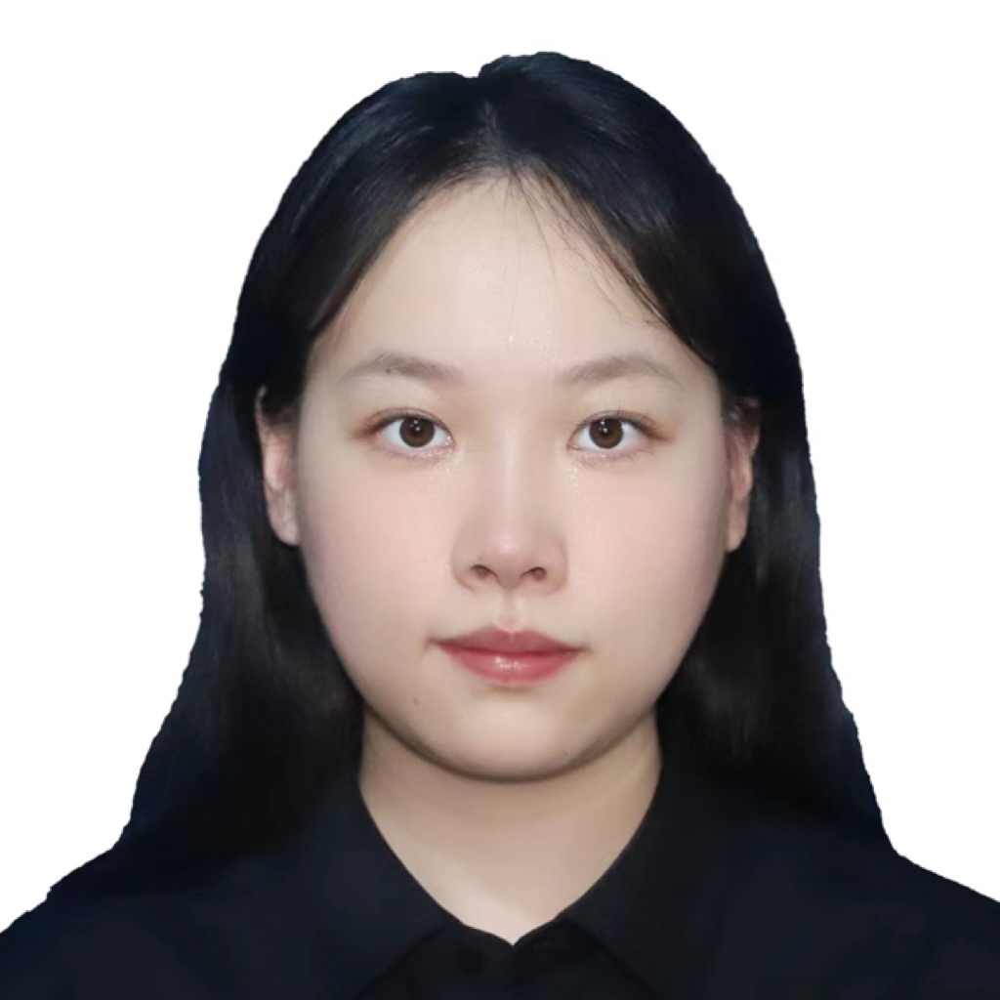

{width="30%" style="float: left; margin-right: 15px; border-radius: 10px;"}

### Introduction  
Hello, my name is Siru Wu, and I use she/her pronouns. I’m originally from Wuhan, China, a vibrant city known for its rich culture and history. I hold a Bachelor of Science in Statistics from the University of California, Davis, where I developed a strong foundation in data analysis, statistical modeling, and machine learning. Currently, I am pursuing my Master’s degree in Data Science and Analytics at Georgetown University, where I am deepening my expertise in data-driven problem-solving, advanced algorithms, and predictive modeling.

Throughout my academic journey, I have been passionate about using data science to drive meaningful insights and create real-world impact. My experiences range from conducting machine learning research on time-series forecasting and health risk prediction to exploring data visualization techniques that enhance decision-making. As I continue my studies, I aim to expand my skill set further, applying data science to complex challenges in healthcare, environmental management, and business analytics. I look forward to leveraging my background and growing expertise to contribute to data-driven innovations that promote positive societal change.

 

### Skills  
- **Programming**: Python (Scikit-learn, TensorFlow/Keras, Matplotlib, Pandas, NumPy, Statsmodels), R (ARIMA, ggplot2), Excel (VLOOKUP, PivotTables)
- **Languages**: Chinese (Native), English (Fluent), Japanese (Fluent), Spanish (Basic)

### Internship Experience  

I have a solid foundation in data science and machine learning, with hands-on experience in time series forecasting, deep learning, and sustainable AI practices. During my internship at Wuhan Kedi Intelligent Environment Co., Ltd, I developed a cutting-edge time series prediction model for water flow management. By integrating **GRU** (Gated Recurrent Unit) into **LSTM** (Long Short-Term Memory), I created a customized predictive model using the Beihu Secondary Pump House flow dataset. I led data preprocessing tasks, including data cleaning, normalization, feature scaling with MinMaxScaler, and data splitting for model training and prediction.

To enhance the model’s performance, I optimized its structure and hyperparameters by adjusting hidden layer size, number of layers, dropout rate, and learning rate. This iterative tuning process resulted in a 20% improvement in prediction accuracy, boosting the model’s practical applicability.

Additionally, I generated visualizations of predicted and actual water flow values using Matplotlib, effectively demonstrating the model's accuracy and reliability. This project strengthened my expertise in time series modeling, machine learning frameworks, and real-world data-driven solutions for environmental resource management.

### Professional Journey  

This semester, I undertook a project titled **"Time Series Prediction of DC Precipitation Using LSTM"**, where I developed a deep learning model to predict precipitation trends in Washington, D.C., using historical meteorological data. I designed and optimized a Long Short-Term Memory (LSTM) model to capture complex precipitation patterns, achieving strong performance results measured through metrics like RMSE and R². To align with environmental responsibility, I incorporated **CodeCarbon** to monitor carbon emissions during model training, showcasing the importance of sustainable AI practices. The project highlighted the potential of data-driven solutions in improving water management, disaster mitigation, and climate resilience. By combining technical expertise with a focus on environmental impact, I demonstrated the role of machine learning in solving real-world challenges and contributing to a sustainable future.  

### Academic Interests

My academic interests lie at the intersection of data science, machine learning, and applied analytics, with a strong focus on real-world problem-solving. I am particularly fascinated by predictive modeling, time-series forecasting, and deep learning applications in fields like healthcare, environmental management, and social policy. The ability to extract meaningful insights from complex datasets and translate them into actionable strategies drives my passion for research and continuous learning. 

I am intrigued by how advanced machine learning models, such as LSTMs and ensemble methods, can capture dynamic patterns in time-dependent data, enabling more accurate predictions and better decision-making. Moreover, I am drawn to interdisciplinary projects that combine statistical modeling, domain-specific knowledge, and innovative technologies to address global challenges. I look forward to contributing to impactful research that not only advances the field of data science but also creates sustainable, data-driven solutions for pressing societal issues.

### Personal Interests  
Outside of academics, I am passionate about language learning and cultural exploration. I have studied Spanish and Japanese, driven by a deep curiosity about global cultures and a desire to communicate across linguistic boundaries. Learning these languages has broadened my worldview and enhanced my ability to connect with people from diverse backgrounds.

My culinary interests reflect this cultural appreciation. I enjoy exploring international cuisines, with a particular fondness for Chinese, Korean, and Japanese food. This passion extends to baking, where I find joy in creating intricate desserts. My latest hobby involves recreating visually stunning cake recipes, blending creativity with precision—a reflection of my analytical and artistic sides.

Looking ahead, I am eager to leverage my data science expertise to bridge disciplines, solve real-world problems, and drive innovation in industries like healthcare and environmental management. By combining data-driven insights with interdisciplinary collaboration, I aim to contribute meaningfully to creating more efficient, predictive, and sustainable solutions for pressing global challenges.

### Projects

For more details about my projects, visit my GitHub repository:  

[Time Series Prediction of DC Precipitation by Using
 LSTM](https://github.com/siruwuu/5550_final_project.git)

[Predicting Health Risk Levels: A Data-Driven Approach Using Machine Learning and Statistical Analysis](https://github.com/dsan-5000/project-siruwuu.git)

---